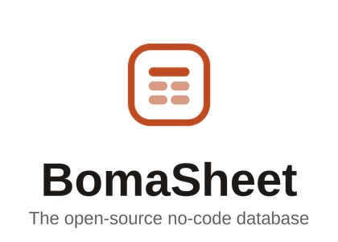

<div align="center">
  <h1 align="center">
    <picture>
      <source media="(prefers-color-scheme: dark)" srcset="static/assets/images/bomasheet-vertical-dark.png">
      
    </picture>
  </h1>
  <h3 align="center"><strong>The open-source no-code database</strong></h3>
  <p>BomaSheet is a fast, real-time, developer-friendly no-code database built on Postgres. It uses a simple, spreadsheet-like interface to create complex enterprise-grade database applications.</p>
</div>

<p align="center">
  <a aria-label="Licence" href="LICENSE">
    
  </a>
</p>

---

## About this project

**BomaSheet is a fork of [Teable](https://github.com/teableio/teable)**, an open-source
no-code database created by the Teable authors and contributors. This project rebrands
and adapts that work; the underlying database engine, API, and application are theirs.

BomaSheet is distributed under the **GNU Affero General Public License v3.0**, the same
licence as upstream Teable. See [LICENSE](LICENSE) for the full text and
[NOTICE](NOTICE) for attribution details.

If you are looking for the original project, please go to
[teable.io](https://teable.io) — it is actively maintained and deserves your support.

### What the AGPL means here

The AGPL is a strong copyleft licence with a network clause (section 13). In practice:

- This repository stays open source, and so must any redistributed or hosted
  modification of it.
- **Anyone who interacts with a BomaSheet instance over a network is entitled to receive
  the complete corresponding source code of that instance**, including local changes.
- Derivative works must also be licensed under the AGPL-3.0.
- Copyright notices and attribution must be preserved.

If you run a modified BomaSheet as a hosted service, you must offer your users the
source of *your* modified version — publishing this repository (and keeping it current
with what you deploy) is how that obligation is met.

## Structure

```
.
├── apps
│   ├── nextjs-app          (front-end, include a nextjs app)
│   └── nestjs-backend      (backend, include a nestjs app)
└── packages
    ├── common-i18n         (locales)
    ├── core                (share code and interface)
    ├── sdk                 (sdk for extensions)
    ├── db-main-prisma      (schema, migrations, prisma client)
    ├── eslint-config-bases (to shared eslint configs)
    ├── icons               (icon set, includes the BomaSheet mark)
    └── ui-lib              (ui component)
```

## Branding

Branding lives in a small number of places, so it is cheap to adjust:

| What | Where |
| --- | --- |
| Theme tokens (colours, radius) | `packages/ui-lib/src/shadcn/global.shadcn.css` |
| Status colours | `apps/nextjs-app/src/themes/colors/index.ts` |
| Logo mark | `packages/icons/src/components/BomaSheet.tsx` |
| Product name (translated UI) | `packages/common-i18n/src/locales/*/common.json` → `brand` |
| Product name (titles, prompts) | `apps/nextjs-app/src/lib/brand.ts` |
| Favicons / PWA icons | `apps/nextjs-app/public/images/favicon/` |
| Email templates | `apps/nestjs-backend/src/features/mail-sender/templates/` |
| Backend brand name | `BRAND_NAME` environment variable |

> **Note:** `BRAND_NAME` is lower-cased and used as the auth cookie prefix
> (`apps/nestjs-backend/src/configs/auth.config.ts`). Changing it invalidates existing
> sessions, so pick a value before going to production.

The internal npm scope remains `@teable/*`. It is an import path, never shown to users,
and renaming it would touch every file in the monorepo for no visible benefit.

## Deploy

### Deploy With Docker

```sh
cd dockers/examples/standalone/
docker-compose up -d
```

For more details, see [dockers/examples](dockers/examples).

## Development

#### 1. Initialize

```sh
# Enabling the Help Management Package Manager
corepack enable

# Install project dependencies
pnpm install

# Build packages
pnpm build
```

#### 2. Run

```sh
pnpm dev
```

## Credits

BomaSheet would not exist without the work of the
[Teable](https://github.com/teableio/teable) team and its contributors. All upstream
copyright is retained; see [NOTICE](NOTICE).

## License

[AGPL-3.0](LICENSE) — Copyright (c) the Teable authors and contributors, and the
BomaSheet contributors.
